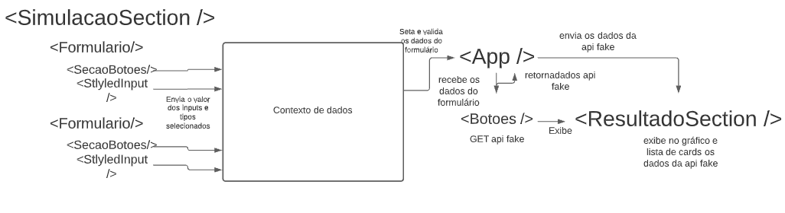

# 💸Simulador de investimentos

### Sobre

Este projeto feito com react é um simulador de investimento responsivo que exibe os resultados da simulação com base em uma API fake.

## Como funciona?

Para fazer a simulação, basta selecionar o tipo de investimento e o tipo de indexação que deseja, a partir disso, logo após clicar em simmular, o resultado é exibido
com todos os dados e o gráfico que compara o investimento com aporte e sem aporte.

### Data flow

Foi usado o hook useContext para apenas os sub componentes compartilharem com o App os estados e dados. Foi muito utilizado o lift state.



### 💅 Styled components

#### Componentes dinâmicos

##### <Botao /> *(Fica em <App />)*
 - **Props**
  - limparCampos (*bool*)
    - para definir as cores diferenciais entre os dois botoes da tela principal
  - valido (*bool*)
    - para definir se o botao deve ou não ser clicado

##### <StyledLabel /> *(Fica em <Formulario />)*
 - **Props**
  - valido (*bool*)
    - para definir a margem, o tamanho da fonte e a cor da label

##### <BotaoDeConjunto /> *(Fica em <ConjuntoDeBotoes />)*
 - **Props**
  - selecionado (*bool*)
    - para definir a cor de fundo do botao e a cor do texto
  - esquerdo (*bool*)
    - para definir o raio das bordas esquerdas
  - direito (*bool*)
    - para definir o raio das bordas direitas

##### <CardConteudo /> *(Fica em <ResultadoSection />)*
 - **Props**
  - destacado (*bool*)
    - para definir a cor do texto e tamanho da fonte

##### <CorLegenda /> *(Fica em <ResultadoSection />)*
 - **Props**
  - cor (*bool*)
    - para definir a cor de fundo

##### <ColunaPretaGrafico /> *(Fica em <ResultadoSection />)*
 - **Props**
  - porentagem (*number*)
    - para definir o tamanho da coluna preta
   - porentagemAporte (*number*)
    - para definir o tamanho da coluna laranja

## Pré requisitos

1. Instale o node.js em https://nodejs.org/en/

2. Verifique se com o node, o npm (node package manager) está instalado com o seguinte comando:

```
npm --version
```

3. Para inicializar a api no seu servidor local você precisará também do npx, para verificar se está instalado, execute o comando:

```
npx --version
```

4. Clone o projeto

```
Comando para clonar o repositorio
```

## Como usar?

### ⚠️ Atenção

- Aqui temos 3 projetos
  - React JS
  - API fake
  - Testes com cypress

**Para rodar os 3 projetos, abra o projeto no visual studio, e com o terminal deste, abra 3 powershells**

- O projeto da API será iniciado primeiro
- O projeto react logo em seguida também será iniciado por outro powershell
- O proejeto de testes precisa que os dois sejam iniciados de acordo com essa ordem

Obrigado 😄

### Iniciando API fake

Com o repositório clonado, na pasta simulador.api (onde fica a api) execute o comando:

```
npx json-server db.json
```

Este comando irá rodar localmente a api fake (db.json)


### Iniciando projeto React.js

Após isso, agora é hora de rodar o projeto em react, que fica na pasta simulador.react

Nesta pasta, entre em app-simulador (projeto react do simulador), e execute o comando:

```
npm start
```

No seu terminal, você verá a seguinte mensagem: **Já há algo rodando nessa porta, deseja rodar o projeto em outra porta? (y/n)**

Clique y (para yes), isso ocorre porque na porta 3000 do seu localhost, a api ja está rodando.

Pronto! agora você ja pode usar o simulador!


## Como rodar os testes (**Cypress**)

### Iniciando projeto de teste

1. Entre na pasta simulador.react
2. Entre na pasta app-simulador
3. Execute o seguinte comando no seu terminal

```
npx cypress open
```

Isto abrirá a guia de testes do cypress

Este projeto é testado em diferentes componentes, então escolha o componente que deseja testar

Pronto, agora é so rodar os testes!


## Regras aplicadas

- Nos inputs do usuário, só é possível inserir números
- Toda vez que o simulador é renderizado, os valores fixos do IPCA e do CDI são preenchidos com um GET na API fake
- O usuário não pode alterar os dados da api fake, nos inputs que carregam o cdi e o ipca
- O usuário não pode fazer a simulação sem preencher os dados
- Toda vez que o usuário clica em *Simular*, é feito um GET na API, com os tipos de investimento e indexação selecionados pelo usuário

## Ferramentas utilizadas

- Prettier (formatador de código)
- React JS code snippets (atalhos para facilitar codar)
- Styled components
- Cypress

## Conceitos utilizados

- Mobile first (responsividade)
- React hooks
  - useState
  - useContext
  - useEffect
- Testes automatizados
  
## Para onde prosseguir?
 - Implementar uma lógica para postar dados na API
 - Implementar mais testes de front
